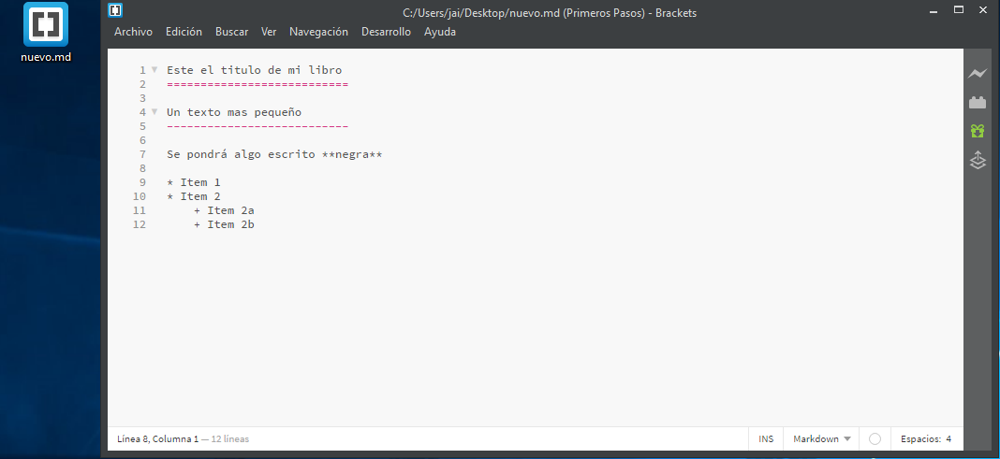
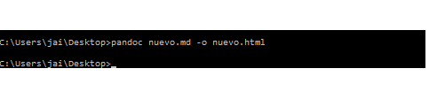
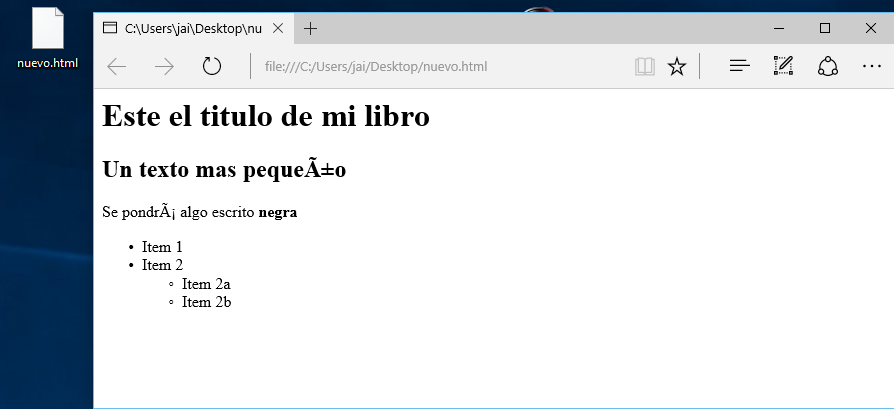

> ### Utilización
> Creamos un fichero md con codigo markdown
> 
> Abrimos la consola de comando de windows, nos posicionamos donde esta el archivo
md que hemos creado que en nuestro caso es  **nuevo.md** y ejecutamos el siguiente comando ```$ nuevo.md -o nuevo.html```
> 
> Como vemos en la siguiente imagen se ha creado un archivo html que tendra el siguente haspecto.
> 
